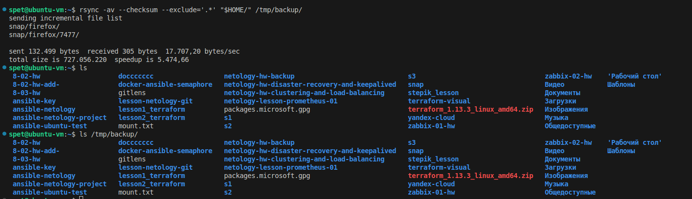
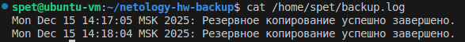

# Домашнее задание к занятию  «Резервное копирование» - Спетницкий Д.И.


---

### Задание 1
- Составьте команду rsync, которая позволяет создавать зеркальную копию домашней директории пользователя в директорию `/tmp/backup`
- Необходимо исключить из синхронизации все директории, начинающиеся с точки (скрытые)
- Необходимо сделать так, чтобы rsync подсчитывал хэш-суммы для всех файлов, даже если их время модификации и размер идентичны в источнике и приемнике.
- На проверку направить скриншот с командой и результатом ее выполнения


------
### Решение 1
```bash
rsync -av --checksum --exclude='.*' "$HOME/" /tmp/backup/
```
- -a — архивный режим
- -v — вывод подробной информации
- --checksum — заставляет rsync вычислять хэши файлов даже тогда, когда размер и время модификации совпадают
- --exclude='.*' — исключает все файлы и директории, имя которых начинается с точки
- "$HOME/" — исходная директория
- /tmp/backup/ — целевая директория для зеркальной копии.
### Скриншоты
#### 1. backup



### Задание 2
- Написать скрипт и настроить задачу на регулярное резервное копирование домашней директории пользователя с помощью rsync и cron.
- Резервная копия должна быть полностью зеркальной
- Резервная копия должна создаваться раз в день, в системном логе должна появляться запись об успешном или неуспешном выполнении операции
- Резервная копия размещается локально, в директории `/tmp/backup`
- На проверку направить файл crontab и скриншот с результатом работы утилиты.

------
### Решение 2
- [script](backup.sh)
- [crontab](my_crontab)
### Скриншоты
#### 1. Логи

